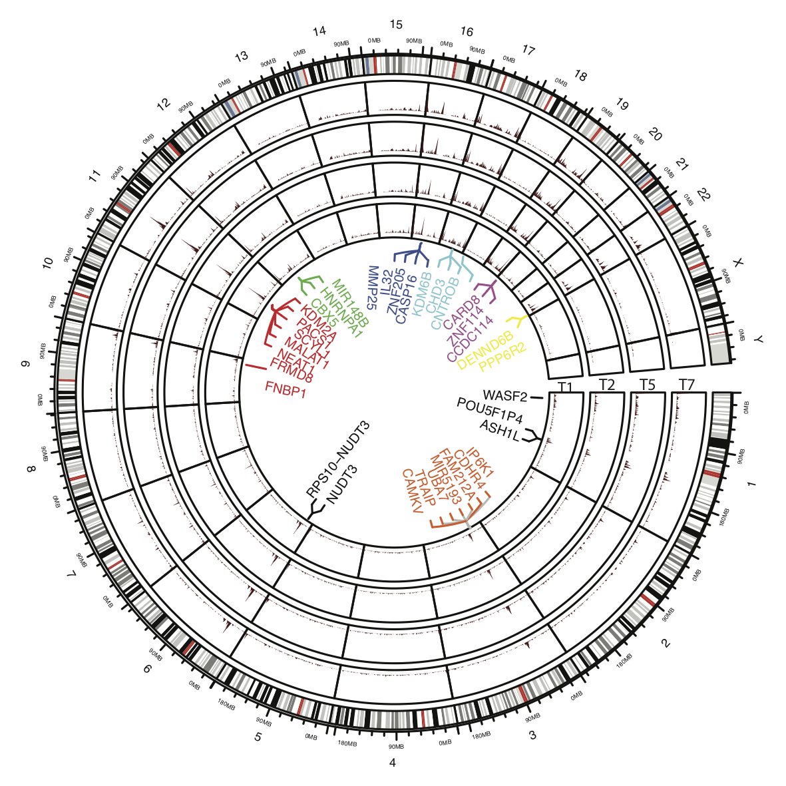
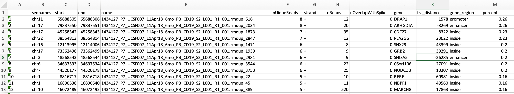

# Identification of lentiviral integration sites and analysis
This repository includes a few analysis pipelines for lentiviral integrome analysis.


- [Sequencing pipeline for our qsLAM PCR assay](#getting-started-with-markdown)
- [Steps for profiling integration sites from scATAC-seq and scMultiome data](#titles)
- [Downstream analysis of vector integration sites](#paragraph)
- [A classifier of integration sites by integrome signatures]


1. Sequencing pipeline for our qsLAM PCR assay
2. [Steps for profiling integration sites from scATAC-seq and scMultiome data] (https://github.com/jyyulab/LVIS_pipeline/blob/master/steps_profile_VIS_scMultiome.md)
4. Downstream analysis of vector integration sites
5. A classifier of integration sites by integrome signatures


## Download
```git clone https://github.com/jyyulab/LVIS_pipeline  # Clone the repo```

## Prerequisites
* [R >3.6.2]
	* [bedr 1.0.7]
* [bedtools 2.29.0]

## Installation
### LVIS_functions.R stores all the related functions

```R
$ source("LVIS_functions.R")
```

## Usage
The function pipeline.R shows step-by-step the compilation of VISs.

### Inputs
The main input is a tab-separated file generated by an in-house pipeline. The pipeline took the reads from a quantitative shearing linear amplification (qsLAM) PCR method, and mapped the reads with insertion junctions the reference genome hg19. The mapped reads correspond to potential VISs specified by the chromosome coordinates. Two potential integration sites that differed by 8 base pairs would be merged. 
An example of input file:


### Outputs
The pipeline.R script shows the the compilation of a final list of VISs. Based on the compiled list, a frequency matrix storing the total number of reads mapped to each of the integration sites across samples from different cell types and time points was constructed for quantifying clonal populations.

To reduce false-positive results, only integration sites with at least two unique reads or at least five total reads were kept. The total number of reads mapped to a VIS was used to quantify the relative population of the corresponding clone. To compile a complete list of integration sites for a patient, integration sites across samples were matched. In short, overlapping integration sites (defined from the start position to the end position in the VIS calling output) from different samples were considered to be the same site, even though the procedure might potentially merge a few integration sites that were close to one another. 

The functions in LVIS_functions.R. can further be used for determining hotspots and quantifying clonal diversity.

